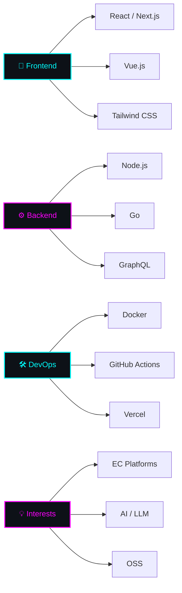
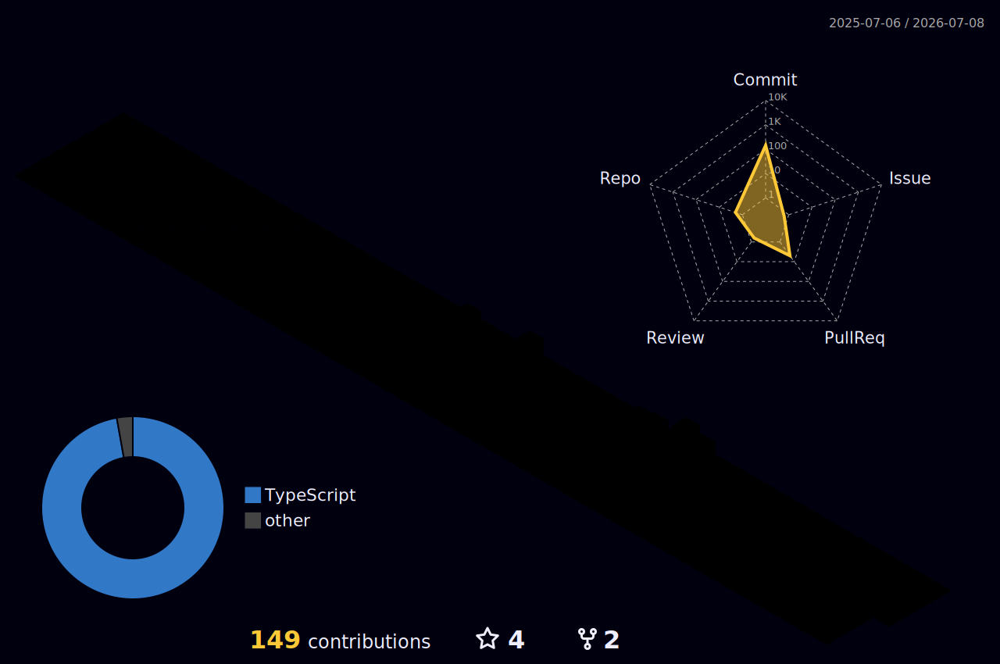

<!-- ============================================== -->
<!--    CYBERPUNK PROFILE | YUISEI MARUYAMA        -->
<!-- ============================================== -->

<!-- HEADER: Waving Capsule Render -->
<div align="center">
  
</div>

<!-- TYPING ANIMATION -->
<div align="center">
  <a href="https://git.io/typing-svg">
    
  </a>
</div>

<br/>

<!-- NEON DIVIDER -->


<br/>

<!-- ==================== TERMINAL ABOUT ME ==================== -->

<h2 align="center">
  &nbsp;
  <samp>About Me</samp>&nbsp;
  
</h2>

<div align="center">
  
</div>

```bash
yuisei@tokyo:~$ neofetch
```
```
                    ╭──────────────────────────────────╮
  ██╗   ██╗██╗   ██╗██╗    │                                  │
  ╚██╗ ██╔╝██║   ██║██║    │  Role:     Engineer               │
   ╚████╔╝ ██║   ██║██║    │  Host:     Tokyo, Japan           │
    ╚██╔╝  ██║   ██║██║    │  Uptime:   Since 2019             │
     ██║   ╚██████╔╝██║    │  Shell:    TypeScript + React     │
     ╚═╝    ╚═════╝ ╚═╝    │  Editor:   VS Code / Cursor      │
                            │  Fuel:     Coffee ☕              │
                            │                                  │
                            │  $ ls ~/current                  │
                            │  ├── EC Platform Dev             │
                            │  ├── AI & Automation             │
                            │  ├── Web Frontend Arch           │
                            │  └── Personal Projects           │
                            ╰──────────────────────────────────╯
```

<div align="center">
  <a href="https://yuisei-maruyama.work/" target="_blank">
    
  </a>
</div>

<br/>

<!-- NEON DIVIDER -->


<br/>

<!-- ==================== TECH STACK ==================== -->

<h2 align="center">
  &nbsp;
  <samp>Tech Stack</samp>&nbsp;
  
</h2>

<br/>

<div align="center">

### `> Languages_`

<a href="https://skillicons.dev">
  
</a>

<br/><br/>

### `> Frontend_`

<a href="https://skillicons.dev">
  
</a>

<br/><br/>

### `> Backend_&_Tools_`

<a href="https://skillicons.dev">
  
</a>

</div>

<br/>

<!-- ==================== SKILL MAP (Mermaid!) ==================== -->
<!-- GitHub がネイティブで Mermaid ダイアグラムをレンダリングします -->

<h3 align="center"><samp>Skill Map</samp></h3>



<br/>

<!-- NEON DIVIDER -->


<br/>

<!-- ==================== 3D CONTRIBUTION GRAPH ==================== -->

<h2 align="center">
  <samp>3D Contribution Graph</samp>
</h2>

<div align="center">
  <picture>
    <source media="(prefers-color-scheme: dark)" srcset="./profile-3d-contrib/profile-night-rainbow.svg" />
    <source media="(prefers-color-scheme: light)" srcset="./profile-3d-contrib/profile-south-season-animate.svg" />
    
  </picture>
</div>

<br/>

<!-- ==================== ACTIVITY GRAPH ==================== -->

<h2 align="center">
  <samp>Activity Graph</samp>
</h2>

<div align="center">
  <a href="https://github.com/Yuisei-Maruyama">
    
  </a>
</div>

<br/>

<!-- NEON DIVIDER -->


<br/>


<!-- ==================== PROFILE VIEWS + FOOTER ==================== -->

<div align="center">
  
</div>

<br/>

<!-- FOOTER: Waving Capsule Render (reverse gradient) -->
<div align="center">
  
</div>
